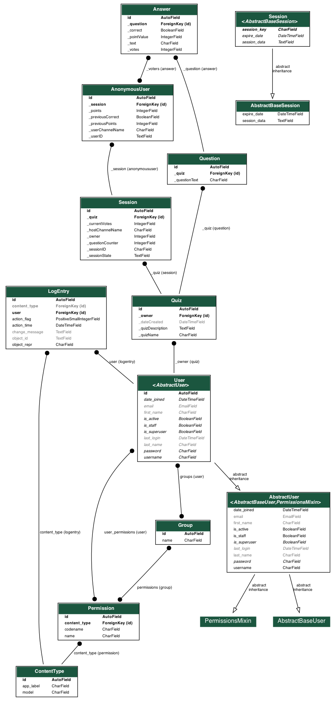

# Live-Quiz-Platform
This is a web-app in which people can create questions for quiz, create room, invite friends via code and act as moderator/teacher who is taking quiz and at the end view the performance.

## Quickstart

To work in a sandboxed Python environment it is recommended to install the app in a Python [virtualenv](https://pypi.python.org/pypi/virtualenv).

1. Install dependencies

    ```bash
    $ cd /path/to/Live-Quiz-Platform
    $ pip install -r requirements.txt
    $ cd src
    ```
2. Setup a Redis  

    ```bash
    brew install redis
    start Redis server using configuration file
    redis-server
    ```
3. Run web-app. It will open in http://127.0.0.1:8000 by default.

   ```bash
   $ python manage.py makemigrations
   $ python manage.py migrate
   $ python manage.py runserver
   ```

4. Run the Test-cases:

    ```bash
    # for running test cases
    $ ./manage.py test
    ```
## Features
[Screen-recording of app](https://github.com/akanuragkumar/Live-Quiz-Platform/blob/master/screenrecording.mov)

      1. Sign Up/Log In.
      2. Create Quiz.
      3. Add questions, allot marking scheme and correct answer.
      4. Create Room and get code.
      5. Other people can join in via code and add display name.
      6. Moderator/teacher can control quiz, add questions on the go and view performance of people in the room.
      7. Edit mode for quiz, questions also available.
## Implementation  
<p align="left">

</p>

### UML Diagram(graphviz generated)

<p align="left">

</p>


